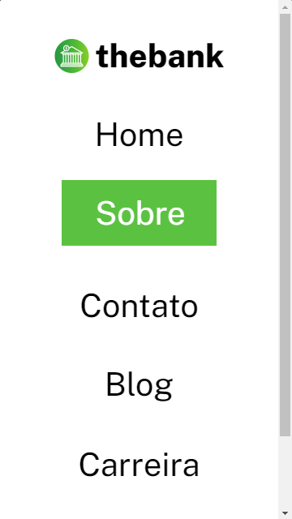

# Exercício 03 - HTML e CSS Avançado Flexbox - Menu com flexbox
No exercício tive como objetivo criar um cabeçalho com menu usando os conhecimentos de HTML e floexbox do curso DevQuest.

## HTML
Para criar o cabeçalho com o menu, comecei usando o elemento header para criar o cabeçalho. Inseri um elemento div e dentro dela uma âncora com a imagem da logo e um span para o texto da logo. Para o menu, usei o elemento nav e uma lista desordenada para criar as opções do menu e um buttom para o botão de cadastro.

## CSS
Para estliziar o menu, usei dois arquivos css. No reset.css eu removi o padding e o margin dos elementos e retirei a estilização padrão da lista. No style.css eu fiz a estilização e responsividade dos elementos do menu.

Quando comecei a estilização, comecei importando a fonte utilizada no exercício, em seguida comecei a estilizar o header, definindo o display flex, dando um padding para afasta-lo das extremidades da página, um justify-content space-between para que a logo do menu e as opções do menu ficassem em extremidades opostas e um align-items center para que a logo e as opções do menu ficassem centralizadas.

Para a responsividade, usei media queries com uma max-width de 688px, dessa forma quando a resolução da tela for menor ou igual a 688px, a logo vai ficar centralizada no topo da página e as opções do menu logo a baixo, e o tamanho da fonte e do botão vão ser ajustados para uma melhor visualização.

## Resultado
### Desktop

### Mobile
